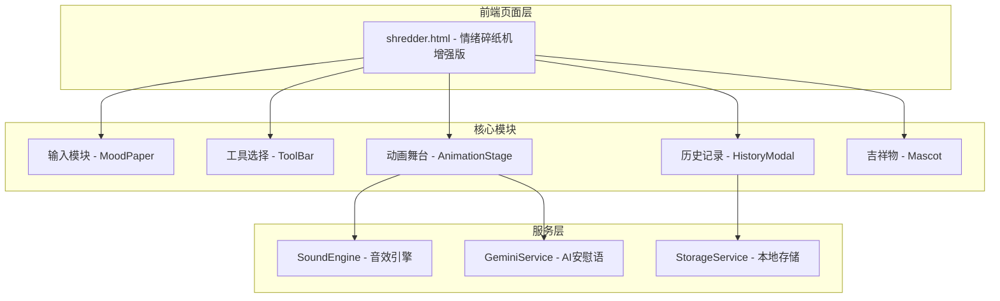
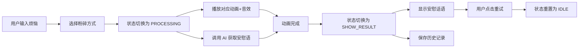

## 产品概述

将 Bad-Mood-Crusher 项目的完整功能移植到现有的情绪碎纸机模块（shredder.html），实现更丰富的情绪释放体验。由于现有项目采用纯 HTML/CSS/JS 架构，需要将原 React + TypeScript + Framer Motion 实现转换为原生实现。

## 核心功能

### 1. 四种粉碎方式动画

- **火箭发射（ROCKET）**：烦恼被装入火箭发射到太空，配合火焰尾迹和星空背景
- **碎纸机（SHREDDER）**：经典碎纸机效果，纸张被吸入并切成碎条飘落
- **泡泡（BUBBLE）**：烦恼文字变成彩色泡泡向上飘散消失
- **黑洞（BLACK_HOLE）**：烦恼被吸入旋转的黑洞中湮灭

### 2. 治愈团子吉祥物

- 粉色圆形团子形象，位于页面顶部
- 三种表情状态：空闲时微笑、处理中惊讶、完成后开心
- 处理状态时配合上下浮动动画

### 3. 历史记录功能

- 使用 localStorage 存储粉碎历史
- 弹窗展示治愈旅程，包含时间戳、粉碎方式、安慰话语
- 支持清空历史记录
- 被粉碎的原文以删除线形式展示

### 4. Gemini AI 安慰话语接口

- 预留 API 配置入口（API Key 输入框）
- 用户可自行配置 Gemini API Key
- 未配置时使用本地随机安慰语库
- 配置后调用 AI 生成个性化安慰话语

### 5. 音效系统

- 每种粉碎方式对应独特音效（火箭推进、碎纸机研磨、泡泡破裂、黑洞低频嗡鸣）
- 完成时播放治愈音效
- 使用 Web Audio API 合成音效
- 提供静音/开启音效按钮

## 技术栈

- 前端框架：纯 HTML/CSS/JavaScript（适配现有项目架构）
- 动画实现：CSS3 Animations + CSS Keyframes + JavaScript 动态控制
- 音效系统：Web Audio API（合成音效，无需外部音频文件）
- 数据存储：localStorage（历史记录）
- AI 接口：Gemini API（预留配置入口）

## 技术架构

### 系统架构



### 模块划分

| 模块 | 职责 | 依赖 |
| --- | --- | --- |
| 状态管理 | 管理 IDLE/PROCESSING/SHOW_RESULT 三种状态 | - |
| 输入模块 | 仿纸张样式的文本输入区 | - |
| 工具栏模块 | 4种粉碎方式按钮及选择逻辑 | 状态管理 |
| 动画舞台 | 根据所选工具播放对应动画 | 音效引擎 |
| 吉祥物模块 | 团子表情和动画控制 | 状态管理 |
| 历史记录模块 | localStorage 读写、弹窗展示 | - |
| 音效引擎 | Web Audio API 合成各类音效 | - |
| AI 服务 | Gemini API 调用及降级处理 | - |


### 数据流



## 实现细节

### 核心目录结构

```
src/main/resources/static/
├── shredder.html          # 主页面（重构）
├── js/
│   └── shredder/
│       ├── soundEngine.js    # 新增：音效引擎
│       └── geminiService.js  # 新增：AI服务
└── css/
    └── shredder.css          # 可选：独立样式文件
```

### 关键代码结构

**状态枚举定义**

```javascript
// 应用状态
const AppState = {
    IDLE: 'IDLE',           // 空闲，等待输入
    PROCESSING: 'PROCESSING', // 处理中，播放动画
    SHOW_RESULT: 'SHOW_RESULT' // 显示结果
};

// 粉碎工具类型
const ToolType = {
    ROCKET: 'ROCKET',       // 火箭发射
    SHREDDER: 'SHREDDER',   // 碎纸机
    BUBBLE: 'BUBBLE',       // 泡泡
    BLACK_HOLE: 'BLACK_HOLE' // 黑洞
};
```

**历史记录数据结构**

```javascript
// 历史记录项
const HistoryItem = {
    id: 'string',           // 唯一ID（时间戳）
    timestamp: 'number',    // 时间戳
    moodText: 'string',     // 原始烦恼文本
    toolType: 'ToolType',   // 使用的粉碎方式
    comfortMessage: 'string' // AI安慰话语
};
```

**音效引擎接口**

```javascript
class SoundEngine {
    init() {}               // 初始化 AudioContext
    toggleMute(muted) {}    // 切换静音
    playToolSound(tool) {}  // 播放工具音效
    playHealSound() {}      // 播放治愈音效
}
```

**Gemini 服务接口**

```javascript
// AI 安慰语服务
async function getComfortingMessage(badMood, apiKey) {
    if (!apiKey) {
        return getRandomFallbackMessage(); // 降级到本地库
    }
    // 调用 Gemini API
}
```

### 技术实现方案

#### 1. 动画实现（CSS + JS）

- 使用 CSS @keyframes 定义基础动画
- JavaScript 动态创建/销毁动画元素
- CSS transform + opacity 实现平滑过渡

#### 2. 音效实现（Web Audio API）

- 火箭：噪声滤波 + 正弦波扫频
- 碎纸机：带通滤波噪声 + LFO 调制
- 泡泡：多个错开的频率扫描
- 黑洞：低频正弦波 + LFO 颤音
- 治愈：大三和弦（C-E-G）渐入

#### 3. AI 接口（预留）

- 设置页面提供 API Key 输入框
- 存储到 localStorage
- 调用时读取并构建请求

### 文档更新计划

| 文档 | 更新内容 |
| --- | --- |
| 03_CURRENT_STATUS_LOG.md | 添加情绪碎纸机增强版更新记录 |
| 09_GAMIFICATION_MODULE_DESIGN.md | 更新情绪碎纸机功能设计章节 |
| 01_PRODUCT_REQUIREMENTS_DOC.md | 更新 P2 情绪碎纸机功能描述 |


## 设计风格

采用治愈系卡通风格，延续 Bad-Mood-Crusher 的温暖柔和设计语言，同时与现有项目的 iOS 极简风格保持协调。

## 页面布局

### 顶部区域

- 左侧：返回按钮（圆角胶囊样式）
- 右侧：静音按钮 + 历史记录按钮
- 中央：治愈团子吉祥物（SVG 绘制）

### 主内容区

- **空闲状态**：标题提示语 + 仿纸张输入框 + 4个粉碎工具按钮
- **处理状态**：动画舞台全屏展示，底部显示处理中提示
- **结果状态**：爱心图标 + 安慰话语卡片 + 重试按钮

### 工具栏设计

四个圆角方形按钮横向排列：

- 碎纸机：蓝色系（剪刀图标）
- 火箭：红色系（火箭图标）
- 泡泡：紫色系（风图标）
- 黑洞：深灰系（虚线圆图标）

### 历史记录弹窗

- 半透明模糊背景遮罩
- 白色圆角卡片容器
- 每条记录包含：粉碎方式标签、日期、安慰话语、原文（删除线）

## 动画设计

- 团子吉祥物：处理中上下浮动，完成后庆祝动画
- 输入框：聚焦时微微放大
- 工具按钮：悬停时上浮并放大
- 页面过渡：淡入淡出 + 缩放组合

## 背景设计

- 浅奶油色基底（#FFFBF5）
- 粉色/蓝色/黄色渐变圆形装饰（模糊处理）
- 呼吸动画（缓慢缩放）