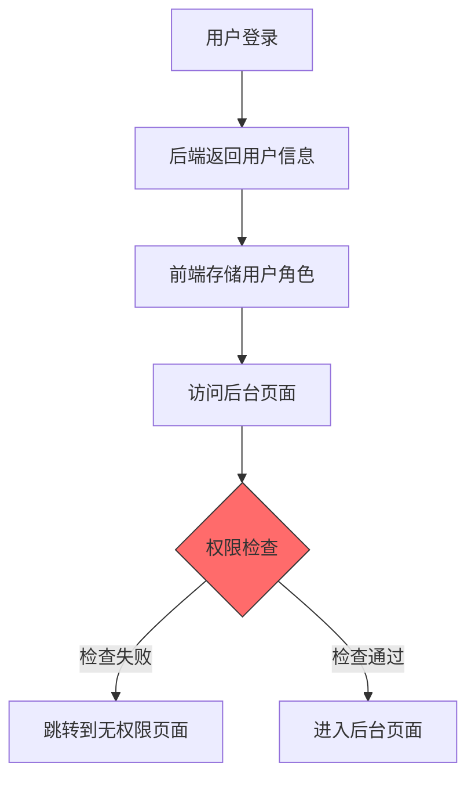

## 产品概述

修复管理员后台权限检查 Bug，确保拥有 admin 角色的用户能够正常访问后台管理页面。

## 核心功能

- 修复前端权限检查逻辑，正确识别 admin 用户角色
- 确保权限验证流程与后端数据保持一致
- 保证 admin 用户能顺利进入后台页面

## 问题分析

根据用户反馈，数据库中 admin 用户的 role 字段已正确设置为 'admin'，但前端仍无法进入后台页面。问题定位于前端权限检查逻辑。

## 可能的问题点

1. **角色字段匹配问题**：前端检查的字段名或值与后端返回不一致（如大小写、字段路径差异）
2. **权限判断条件错误**：权限校验逻辑存在 Bug，导致即使角色正确也被拒绝
3. **用户信息未正确获取**：登录后用户角色信息未正确存储或读取
4. **路由守卫配置问题**：后台路由的权限守卫配置有误

## 排查方向

## 修复策略

1. 检查用户登录后角色信息的存储逻辑
2. 核对权限检查代码中的角色判断条件
3. 确保字段名、值的大小写与后端一致
4. 验证路由守卫的权限配置

## Agent Extensions

### SubAgent

- **code-explorer**
- 用途：搜索项目中所有与权限检查、角色验证、路由守卫相关的代码文件
- 预期结果：定位到前端权限检查的具体代码位置，找出 Bug 所在