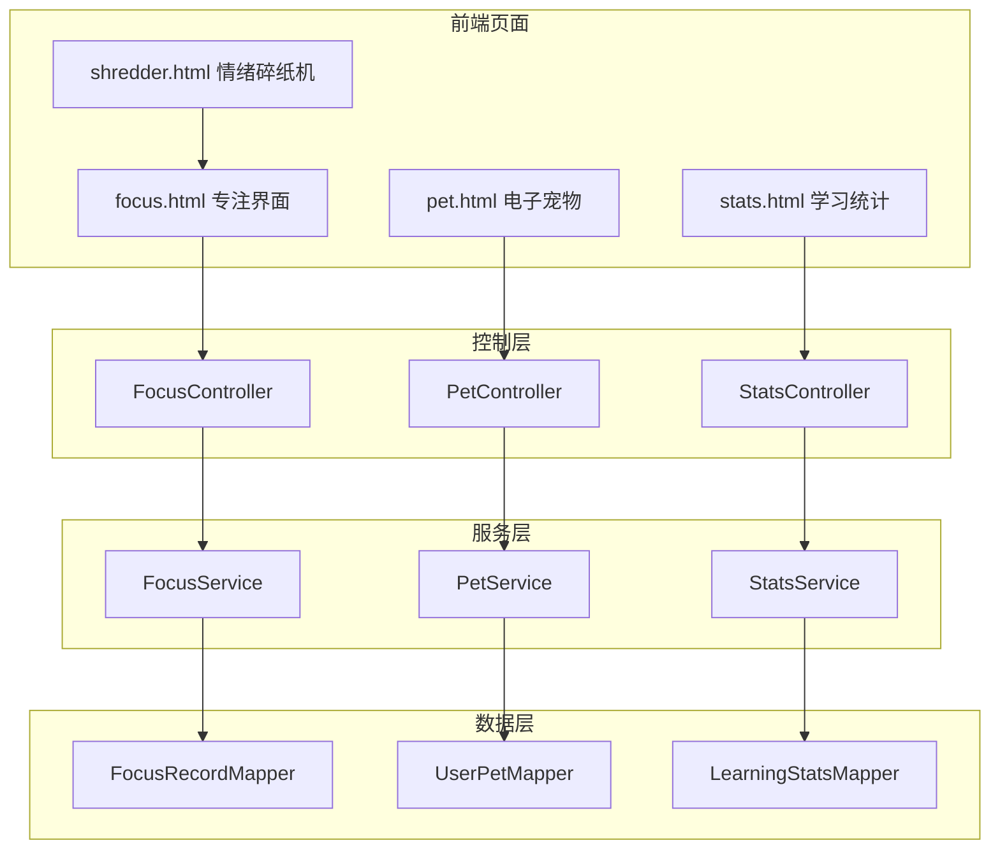

## Product Overview

一个学习专注应用的游戏化增强模块，旨在通过可视化学习数据和趣味性激励机制，提升用户的学习动力和专注体验。

## Core Features

### 专注界面优化

- 实时显示今日累计学习时长（动态更新）
- 显示当前累计经验值和等级进度
- 专注过程中的实时计时器和经验值预览

### 电子宠物系统

- 宠物孵化：用户首次进入时选择宠物蛋进行孵化
- 宠物成长：根据学习时长积累经验，宠物逐级成长
- 宠物进化：达到特定等级后宠物形态进化
- 宠物交互：点击宠物触发动画和语音鼓励

### 情绪碎纸机

- 输入框供用户输入负面情绪或烦恼文字
- 点击"碎纸"按钮触发碎纸动画效果
- 文字被撕碎飘落的视觉效果
- 数据不保存，仅作为情绪释放工具

### 学习数据统计

- 每日/每周/每月学习时长统计图表
- 学习时段分布热力图
- 学习习惯分析和个性化建议
- 学习画像标签生成

## Tech Stack

- 后端框架：Spring Boot + MyBatis（沿用现有架构）
- 前端：HTML + CSS + JavaScript + jQuery
- 数据库：MySQL（已有表结构）
- 图表库：ECharts（用于数据可视化）

## Tech Architecture

### System Architecture



### Module Division

- **专注模块**：负责专注计时、经验值计算、今日时长统计
- **宠物模块**：负责宠物状态管理、成长进化逻辑、交互响应
- **统计模块**：负责学习数据聚合、图表数据生成、画像分析

### Data Flow

用户开始专注 → 前端计时器启动 → 定时同步后端 → 结束时保存记录 → 更新宠物经验 → 刷新统计数据

## Implementation Details

### Core Directory Structure

```
qr_code/
├── src/main/java/.../
│   ├── controller/
│   │   ├── PetController.java      # 新增：宠物系统API
│   │   └── StatsController.java    # 新增：统计数据API
│   ├── service/
│   │   ├── PetService.java         # 新增：宠物业务逻辑
│   │   └── StatsService.java       # 新增：统计业务逻辑
│   └── mapper/
│       └── (已有UserPetMapper、LearningStatsMapper)
├── src/main/resources/
│   ├── static/
│   │   ├── css/
│   │   │   ├── pet.css             # 新增：宠物样式
│   │   │   └── shredder.css        # 新增：碎纸机样式
│   │   ├── js/
│   │   │   ├── focus-enhanced.js   # 新增：专注界面增强
│   │   │   ├── pet.js              # 新增：宠物交互
│   │   │   └── shredder.js         # 新增：碎纸机动画
│   │   └── images/
│   │       └── pets/               # 新增：宠物图片资源
│   └── templates/
│       ├── focus.html              # 修改：增强专注界面
│       ├── pet.html                # 新增：宠物页面
│       ├── shredder.html           # 新增：碎纸机页面
│       └── stats.html              # 新增：统计页面
```

### Key Code Structures

**宠物数据结构**：定义宠物的核心属性，包括等级、经验值、形态等信息。

```java
// PetVO - 宠物视图对象
public class PetVO {
    private Long id;
    private String name;
    private Integer level;
    private Integer exp;
    private Integer expToNextLevel;
    private String stage;  // egg, baby, teen, adult
    private String mood;   // happy, normal, sad
}
```

**统计数据结构**：用于前端图表展示的学习统计数据。

```java
// StatsVO - 统计视图对象
public class StatsVO {
    private Integer todayMinutes;
    private Integer weekMinutes;
    private Integer monthMinutes;
    private List<DailyStats> dailyTrend;
    private Map<Integer, Integer> hourlyDistribution;
    private List<String> habitTags;
}
```

### Technical Implementation Plan

**碎纸机动画实现**：

1. 使用CSS3 animation实现纸张撕碎效果
2. 将输入文字分割成多个span元素
3. 每个span应用随机的旋转、位移和透明度动画
4. 动画结束后清空DOM元素

**宠物成长算法**：

1. 经验值公式：专注分钟数 × 基础倍率
2. 升级所需经验：当前等级 × 100
3. 进化条件：等级达到10/20/30时触发形态变化

## Design Style

采用温馨可爱的游戏化设计风格，结合柔和的渐变色彩和流畅的动画效果，营造轻松愉悦的学习氛围。

## Page Planning

### 专注界面增强 (focus.html)

- **顶部状态栏**：显示今日累计学习时长（大字体）、当前等级和经验条
- **中央计时区**：圆形计时器，显示当前专注时长，周围有呼吸灯效果
- **实时经验预览**：计时器下方显示本次预计获得的经验值
- **底部操作区**：开始/暂停/结束按钮，快捷入口到宠物和统计页面

### 电子宠物页面 (pet.html)

- **宠物展示区**：居中显示宠物形象，带有idle动画
- **状态信息栏**：宠物名称、等级、经验进度条、心情状态
- **交互按钮组**：喂食、抚摸、对话等交互按钮
- **成长日志**：底部滚动显示宠物成长里程碑

### 情绪碎纸机页面 (shredder.html)

- **输入区域**：仿纸张样式的文本输入框，带有纸张纹理背景
- **碎纸机造型**：页面下方显示碎纸机入口动画
- **碎纸动画区**：文字被吸入碎纸机后飘落的粒子效果
- **鼓励语展示**：碎纸完成后显示随机正能量语句

### 学习统计页面 (stats.html)

- **时间选择器**：日/周/月切换标签
- **核心数据卡片**：总时长、平均时长、最长连续天数
- **趋势图表区**：折线图展示学习时长趋势
- **时段热力图**：24小时学习时段分布
- **学习画像区**：标签云展示用户学习特征

## Agent Extensions

### SubAgent

- **code-explorer**
- Purpose：探索现有项目结构，了解FocusService、UserPetMapper等已有代码的实现细节
- Expected outcome：获取现有代码的接口定义和数据结构，确保新功能与现有架构无缝集成