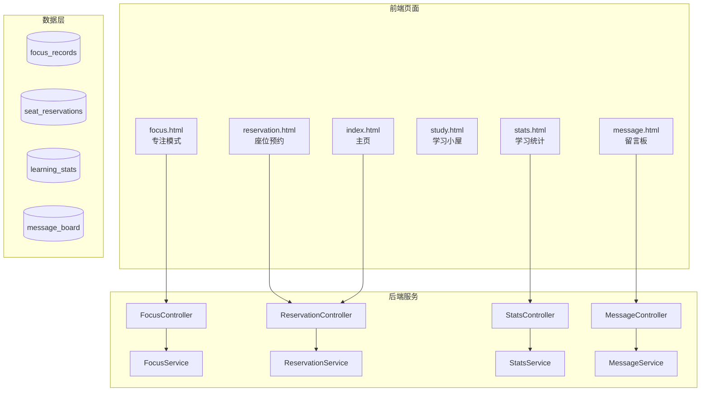

## 产品概述

针对云端自习室系统进行功能优化和Bug修复，涉及专注模式UI优化、座位预约系统重新设计、学习统计修复、主页占座显示优化等多个模块的改进。

## 核心功能

### 1. 专注模式UI优化

- 将番茄钟/自由计时切换移入专注设置面板
- 修复第1个番茄信息条与经验条重叠的布局问题
- 番茄钟完成时显示20%额外经验奖励标注

### 2. 座位预约系统重新设计（方案C）

- 预约范围限定为当日和次日两天
- 每位用户最多只能有1个"待使用"状态的预约
- 时间段支持用户自选（开始时间-结束时间）
- 优化预约冲突检测逻辑

### 3. 学习工具页面调整

- 删除独立的番茄钟入口（已集成到专注模式）
- 删除独立的白噪音入口（已集成到专注模式）
- 保留其他学习工具入口

### 4. 学习统计修复

- 修复统计数据不显示的问题
- 修复返回按钮跳转到主页而非学习小屋

### 5. 留言板功能调整

- 暂时移除图片上传功能

### 6. 主页占座状态优化

- 占座后显示醒目的状态卡片
- 显示座位号、已使用时长、电源状态
- 提供一键离座断电按钮

### 7. 测试数据创建

- 创建用于演示的虚假测试数据（用户、专注记录、座位预约等）

## 技术栈

- 后端框架：Spring Boot + MyBatis-Plus
- 数据库：MySQL
- 前端技术：纯HTML/CSS/JavaScript + Vue 3 CDN

## 技术架构

### 模块依赖关系



### 数据流

1. 专注模式：用户操作 -> FocusController -> FocusService -> focus_records/learning_stats
2. 座位预约：用户选择 -> ReservationController -> ReservationService -> seat_reservations
3. 学习统计：页面加载 -> StatsController -> StatsService -> learning_stats/focus_records

## 实现细节

### 修改文件结构

```
project-root/
├── src/main/java/com/example/qr_code/
│   ├── controller/
│   │   └── ReservationController.java  # 修改：预约规则调整
│   ├── service/
│   │   ├── ReservationService.java     # 修改：预约逻辑重构
│   │   └── StatsService.java           # 修改：统计数据修复
│   └── mapper/
│       └── SeatReservationMapper.java  # 修改：新增查询方法
├── src/main/resources/static/
│   ├── focus.html      # 修改：UI布局优化，移动模式切换
│   ├── reservation.html # 重构：预约系统重新设计
│   ├── stats.html      # 修改：返回跳转修复
│   ├── study.html      # 修改：删除番茄钟和白噪音入口
│   ├── index.html      # 修改：占座状态卡片优化
│   └── message.html    # 修改：移除图片上传
└── src/main/resources/
    └── data.sql        # 新增：测试数据脚本
```

### 关键代码变更

**座位预约规则调整**：

```java
// ReservationService.java 核心修改
public String createReservation(Long userId, Long seatId, LocalDate date, 
                                LocalTime startTime, LocalTime endTime) {
    // 1. 仅允许当日和次日预约
    LocalDate maxDate = LocalDate.now().plusDays(1);
    if (date.isAfter(maxDate)) {
        return "只能预约今天或明天";
    }
    
    // 2. 检查用户是否已有待使用的预约
    int pendingCount = reservationMapper.countUserPendingReservations(userId);
    if (pendingCount >= 1) {
        return "您已有一个待使用的预约，请先使用或取消";
    }
    
    // 3. 自选时间段（不再限制固定时间段）
    // ... 时间冲突检测
}
```

**专注模式UI调整**：

```css
/* focus.html 样式修改 */
/* 移除顶部模式切换器，移入设置面板 */
.mode-switcher {
    display: none; /* 原位置隐藏 */
}

/* 设置面板内新增模式切换 */
.settings-mode-switcher {
    display: flex;
    gap: 8px;
    margin-bottom: 16px;
}

/* 修复番茄钟信息与经验条重叠 */
.pomodoro-info {
    top: 130px; /* 调整位置避免重叠 */
}
```

### 技术实现方案

**1. 专注模式优化**

- 将 `.mode-switcher` 移动到设置面板内
- 调整 `.pomodoro-info` 的 top 定位，避免与 `.exp-bar-section` 重叠
- 在经验获取提示中添加番茄钟20%奖励说明

**2. 座位预约重构**

- 修改日期选择器：只显示今天和明天两个选项
- 新增"待使用预约"数量检查接口
- 将固定时间段改为时间选择器（开始-结束）

**3. 学习统计修复**

- 检查 StatsService 中的数据查询逻辑
- 确保 focus_records 表有 start_time 字段数据
- 修复返回按钮跳转地址为 `/index.html`

**4. 测试数据生成**

- 创建SQL脚本插入虚假用户数据
- 插入专注记录（覆盖最近7天）
- 插入座位预约记录

## Agent Extensions

### MCP

- **mysql**
- Purpose: 执行SQL脚本创建测试数据，包括插入用户、专注记录、座位预约等虚假数据
- Expected outcome: 数据库中生成可供演示的测试数据集