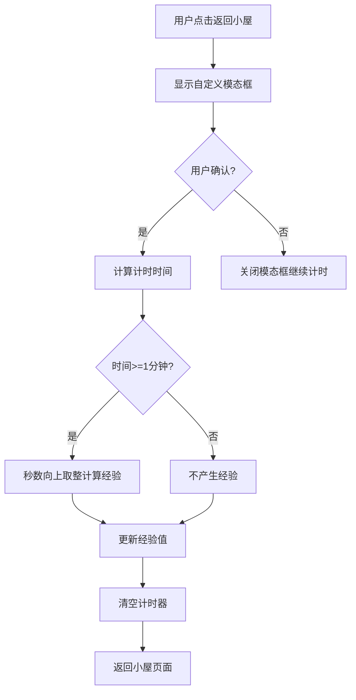

## 产品概述

对现有宠物陪伴计时应用进行优化升级，包括宠物视觉效果提升、用户交互体验改进、路由问题修复和音效功能完善。

## 核心功能

- **宠物显示优化**：将现有 emoji 宠物替换为网络免费可爱动物 GIF 动图，展示完整身体和动作效果
- **返回小屋模态框**：自定义模态框替代原有提示，显示"将清空计时时间并转化为经验"的确认信息
- **经验转化规则**：计时满1分钟以上才产生经验，超过1分钟的秒数向上取整计算（如1分23秒计为2分钟经验）
- **路由修复**：解决 /app/ 路径下的 404 错误问题
- **碎纸机音效**：配置并集成碎纸机音效（static/audio/shredder.mp3）

## 技术方案

### 现有项目分析

基于现有项目进行功能优化，需先探索项目结构和现有实现逻辑。

### 模块划分

#### 宠物显示模块

- **职责**：管理宠物 GIF 资源加载和显示
- **技术要点**：
- 使用网络 GIF 资源（如 GIPHY、Tenor 等免费资源）
- 图片懒加载和缓存优化
- GIF 尺寸适配和响应式显示

#### 模态框模块

- **职责**：自定义"返回小屋"确认模态框
- **技术要点**：
- 模态框组件封装
- 显示计时时间和预计获得经验
- 确认/取消交互逻辑

#### 经验计算模块

- **职责**：计时时间转经验值计算
- **技术要点**：
- 时间阈值判断（>=1分钟）
- 秒数向上取整算法：`Math.ceil(totalSeconds / 60)`
- 经验值状态更新

#### 路由配置模块

- **职责**：修复 /app/ 路径 404 问题
- **技术要点**：
- 检查路由配置
- 确保路径匹配和重定向正确

#### 音效模块

- **职责**：碎纸机音效播放
- **技术要点**：
- Audio API 封装
- 音效文件路径：`static/audio/shredder.mp3`
- 播放时机控制

### 数据流



### 关键代码结构

**经验计算函数**

```typescript
function calculateExperience(totalSeconds: number): number {
  if (totalSeconds < 60) return 0;
  return Math.ceil(totalSeconds / 60);
}
```

**音效播放封装**

```typescript
class AudioPlayer {
  private audio: HTMLAudioElement;
  
  constructor(src: string) {
    this.audio = new Audio(src);
  }
  
  play(): void {
    this.audio.currentTime = 0;
    this.audio.play();
  }
}

const shredderSound = new AudioPlayer('static/audio/shredder.mp3');
```

### 实现要点

1. **GIF 资源选择**：使用免费可商用的动物 GIF，确保加载速度和显示效果
2. **模态框设计**：清晰展示时间信息和经验预览，提供明确的操作按钮
3. **路由调试**：检查项目路由配置文件，确认 /app/ 路径正确注册

## Agent Extensions

### SubAgent

- **code-explorer**
- 用途：探索现有项目结构，了解宠物显示、计时器、路由配置等模块的实现方式
- 预期结果：获取项目目录结构、关键组件位置、现有实现逻辑，为后续修改提供准确依据