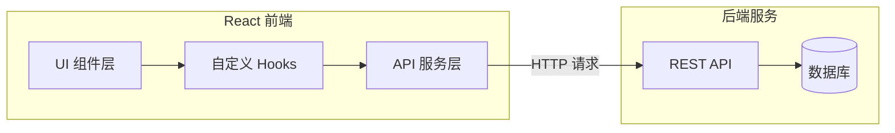

## 产品概述

将现有 React 前端项目从静态模拟数据迁移到真实后端 API 调用，实现完整的前后端数据交互，并完成生产环境构建部署。

## 核心功能

- API 服务层封装：创建统一的 HTTP 请求封装，支持请求拦截、响应处理和错误管理
- 数据层替换：将所有页面的静态模拟数据替换为真实 API 调用
- 状态管理优化：处理 API 请求的加载状态、错误状态和数据缓存
- 环境配置：区分开发环境（5173端口）和生产环境（9090端口）的 API 地址配置
- 生产构建部署：完成项目构建并部署到 9090 端口

## 技术栈

- 前端框架：React 18 + TypeScript
- 构建工具：Vite 5
- 样式方案：Tailwind CSS
- HTTP 客户端：Axios
- 开发端口：5173
- 生产端口：9090

## 技术架构

### 系统架构



### 模块划分

- **API 服务模块**：封装 Axios 实例，统一处理请求/响应拦截、错误处理、Token 管理
- **类型定义模块**：定义 API 请求和响应的 TypeScript 接口
- **自定义 Hooks 模块**：封装数据获取逻辑，管理加载和错误状态
- **环境配置模块**：管理不同环境的 API 基础地址

### 数据流

用户操作 -> React 组件 -> 自定义 Hook -> API 服务层 -> 后端 API -> 响应数据 -> 状态更新 -> UI 重新渲染

## 实现细节

### 核心目录结构

```
src/
├── api/
│   ├── index.ts          # Axios 实例和拦截器配置
│   ├── qrcode.ts         # 二维码相关 API
│   └── types.ts          # API 类型定义
├── hooks/
│   └── useApi.ts         # 通用 API 请求 Hook
├── config/
│   └── env.ts            # 环境变量配置
└── .env.development      # 开发环境变量
└── .env.production       # 生产环境变量
```

### 关键代码结构

**Axios 实例配置**：创建统一的 HTTP 客户端，配置基础 URL、超时时间、请求/响应拦截器，处理认证 Token 和全局错误。

```typescript
// api/index.ts
import axios from 'axios';

const apiClient = axios.create({
  baseURL: import.meta.env.VITE_API_BASE_URL,
  timeout: 10000,
  headers: { 'Content-Type': 'application/json' }
});

apiClient.interceptors.response.use(
  response => response.data,
  error => Promise.reject(error)
);

export default apiClient;
```

**通用 API Hook**：封装数据获取逻辑，提供统一的加载状态、错误处理和数据管理。

```typescript
// hooks/useApi.ts
function useApi<T>(fetcher: () => Promise<T>) {
  const [data, setData] = useState<T | null>(null);
  const [loading, setLoading] = useState(false);
  const [error, setError] = useState<Error | null>(null);
  // ... 实现逻辑
  return { data, loading, error, refetch };
}
```

### 环境配置

```
# .env.development
VITE_API_BASE_URL=http://localhost:8080/api

# .env.production  
VITE_API_BASE_URL=/api
```

### 构建部署配置

在 vite.config.ts 中配置生产构建，确保静态资源正确输出，配合后端服务部署到 9090 端口。

## Agent Extensions

### SubAgent

- **code-explorer**
- 用途：探索现有 React 项目结构，识别所有使用静态模拟数据的组件和页面
- 预期结果：获取完整的项目文件结构、现有 API 调用模式、需要替换的模拟数据位置列表