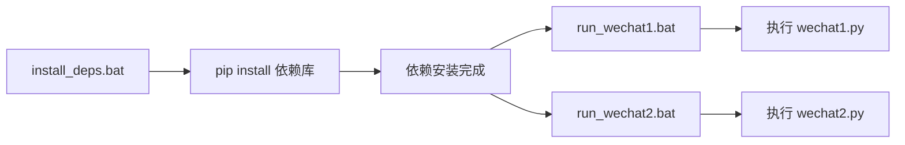

## 产品概述

配置 Python 环境并创建便捷的运行脚本，使用户能够方便地执行两个微信自动化脚本（wechat1.py 和 wechat2.py）。

## 核心功能

1. **依赖安装**：为两个 Python 脚本安装所需的第三方库

- wechat1.py 依赖：uiautomation, pyperclip, pywin32
- wechat2.py 依赖：requests, qrcode, Pillow

2. **运行脚本创建**：创建批处理脚本(.bat)，方便用户一键运行 Python 脚本

- run_wechat1.bat：运行微信 UI 自动化脚本（搜索公众号并点击菜单）
- run_wechat2.bat：运行 Token 请求脚本（直接获取校园码二维码）

3. **环境配置说明**：提供清晰的使用说明文档

## 技术栈

- 运行环境：Python 3.14.2 (已存在于用户系统)
- Python 路径：`C:\Users\ngioigli\AppData\Roaming\uv\python\cpython-3.14.2-windows-x86_64-none\python.exe`
- 脚本类型：Windows 批处理脚本 (.bat)

## 技术架构

### 依赖库分析

#### wechat1.py 依赖

| 库名 | 用途 |
| --- | --- |
| uiautomation | Windows UI 自动化操作 |
| pyperclip | 剪贴板操作 |
| pywin32 | Windows API 调用 |


#### wechat2.py 依赖

| 库名 | 用途 |
| --- | --- |
| requests | HTTP 请求 |
| qrcode | 二维码生成 |
| Pillow | 图像处理 |


### 数据流



## 实现细节

### 目录结构

```
project-root/
├── src/main/java/com/example/qr_code/wechat/
│   ├── wechat1.py              # 已存在：微信UI自动化脚本
│   ├── wechat2.py              # 已存在：Token请求脚本
│   ├── install_deps.bat        # 新增：依赖安装脚本
│   ├── run_wechat1.bat         # 新增：运行wechat1脚本
│   ├── run_wechat2.bat         # 新增：运行wechat2脚本
│   └── README.md               # 新增：使用说明文档
```

### 关键代码结构

**install_deps.bat**：一键安装所有依赖库

```
@echo off
set PYTHON_PATH=C:\Users\ngioigli\AppData\Roaming\uv\python\cpython-3.14.2-windows-x86_64-none\python.exe
%PYTHON_PATH% -m pip install uiautomation pyperclip pywin32 requests qrcode Pillow
pause
```

**run_wechat1.bat**：运行微信UI自动化脚本

```
@echo off
set PYTHON_PATH=C:\Users\ngioigli\AppData\Roaming\uv\python\cpython-3.14.2-windows-x86_64-none\python.exe
cd /d %~dp0
%PYTHON_PATH% wechat1.py
pause
```

### 技术实现计划

1. **问题**：用户需要便捷地安装依赖并运行脚本
2. **方案**：创建批处理脚本，封装 Python 路径和执行命令
3. **关键技术**：Windows 批处理脚本、pip 包管理
4. **实现步骤**：

- 创建依赖安装脚本
- 创建两个运行脚本
- 编写使用说明文档

5. **测试策略**：手动执行脚本验证功能