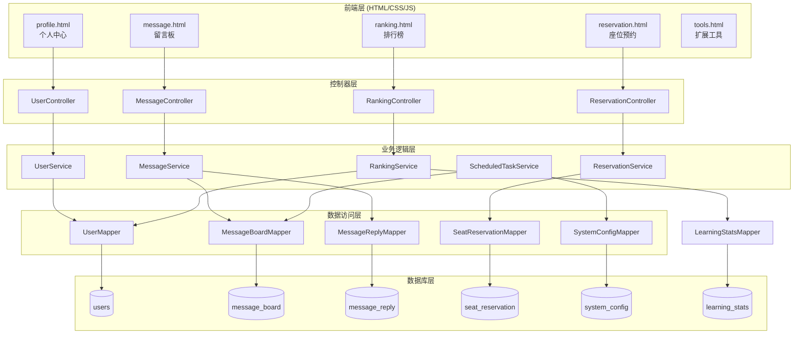
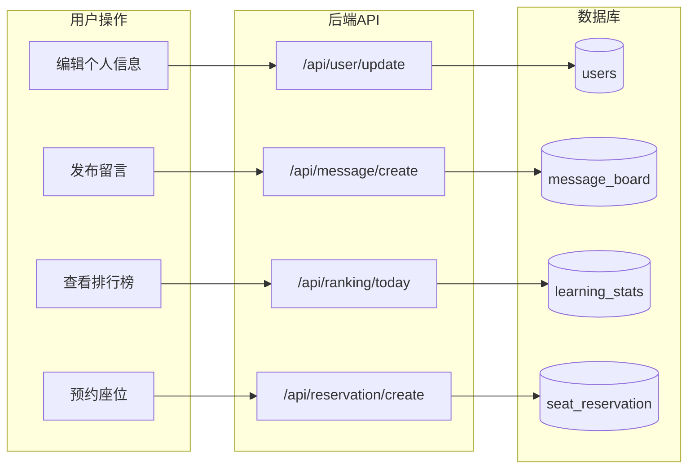

## 产品概述

云端自习室核心功能增强项目，在现有的 Spring Boot + MyBatis-Plus + MySQL + HTML/CSS/JS 技术栈基础上，新增个人中心编辑、留言板系统、多维排行榜、座位预约系统以及扩展功能模块。

## 核心功能

### 1. 个人中心增强

- 显示已学习天数（累计天数和连续天数）
- 支持编辑个人信息：昵称、头像（可选预设或上传）、个性签名、今日状态
- 个人中心页面美化，展示学习成就

### 2. 留言板系统

- 用户可发布帖子、回复帖子（仅支持一层回复）、编辑和删除自己的留言
- 管理员可封禁留言（不删除只隐藏）
- 支持配置自动清理周期（默认2周）
- 发帖时显示文明提示

### 3. 多维排行榜

- 今日排行：当日学习时长排名
- 本周排行：本周累计学习时长排名
- 本月排行：本月累计学习时长排名
- 本年排行：本年累计学习时长排名
- 总排行：累计总学习时长排名

### 4. 座位预约系统

- 用户可提前预约座位（选择日期时段）
- 支持取消预约
- 预约超时自动释放座位
- 管理员可查看预约记录

### 5. 扩展功能

- 白噪音播放器（已有基础）
- 学习打卡日历（日历视图展示学习记录）
- 番茄钟（25分钟工作+5分钟休息循环）
- 学习目标设定与追踪
- 匿名鼓励卡片（随机展示其他用户的鼓励语）

## 技术栈

- **后端框架**: Spring Boot 2.6.13 + MyBatis-Plus 3.5.3.1
- **数据库**: MySQL 8.x
- **前端**: 纯 HTML/CSS/JavaScript（部分页面使用 Vue 3 CDN）
- **构建工具**: Maven 3.9+
- **运行环境**: JDK 17+

## 技术架构

### 系统架构



### 模块划分

**1. 用户模块增强**

- 职责：用户信息编辑、头像管理、学习天数统计
- 技术：复用现有 UserMapper，扩展 User 实体字段
- 接口：`/api/user/update`, `/api/user/avatar`

**2. 留言板模块（新增）**

- 职责：帖子发布、回复、封禁、定时清理
- 技术：新建 MessageService + 定时任务
- 接口：`/api/message/*`

**3. 排行榜模块（新增）**

- 职责：多维度排行榜查询
- 技术：基于 learning_stats 表聚合统计
- 接口：`/api/ranking/*`

**4. 座位预约模块（新增）**

- 职责：预约、取消、自动释放
- 技术：新建 ReservationService + 定时任务
- 接口：`/api/reservation/*`

### 数据流



## 实现细节

### 核心目录结构（新增/修改部分）

```
src/main/java/com/example/qr_code/
├── controller/
│   ├── UserController.java        # 新增：用户信息编辑接口
│   ├── MessageController.java     # 新增：留言板接口
│   ├── RankingController.java     # 新增：排行榜接口
│   └── ReservationController.java # 新增：座位预约接口
├── service/
│   ├── UserService.java           # 新增：用户业务逻辑
│   ├── MessageService.java        # 新增：留言板业务逻辑
│   ├── RankingService.java        # 新增：排行榜业务逻辑
│   ├── ReservationService.java    # 新增：预约业务逻辑
│   └── ScheduledTaskService.java  # 新增：定时任务
├── entity/
│   ├── User.java                  # 修改：新增 signature, today_status, study_days 字段
│   ├── MessageBoard.java          # 新增：留言板实体
│   ├── MessageReply.java          # 新增：留言回复实体
│   ├── SeatReservation.java       # 新增：座位预约实体
│   └── SystemConfig.java          # 新增：系统配置实体
├── mapper/
│   ├── MessageBoardMapper.java    # 新增
│   ├── MessageReplyMapper.java    # 新增
│   ├── SeatReservationMapper.java # 新增
│   └── SystemConfigMapper.java    # 新增
└── config/
    └── ScheduleConfig.java        # 新增：定时任务配置

src/main/resources/static/
├── profile.html                   # 修改：增强个人中心
├── message.html                   # 新增：留言板页面
├── ranking.html                   # 新增：排行榜页面
├── reservation.html               # 新增：座位预约页面
└── tools.html                     # 新增：扩展工具页面
```

### 关键代码结构

**新增数据库表结构**

```sql
-- 留言板主表
CREATE TABLE message_board (
    id BIGINT AUTO_INCREMENT PRIMARY KEY,
    user_id BIGINT NOT NULL,
    content TEXT NOT NULL,
    is_hidden TINYINT(1) DEFAULT 0 COMMENT '是否被封禁隐藏',
    reply_count INT DEFAULT 0,
    created_at TIMESTAMP DEFAULT CURRENT_TIMESTAMP,
    updated_at TIMESTAMP DEFAULT CURRENT_TIMESTAMP ON UPDATE CURRENT_TIMESTAMP,
    FOREIGN KEY (user_id) REFERENCES users(id)
);

-- 留言回复表
CREATE TABLE message_reply (
    id BIGINT AUTO_INCREMENT PRIMARY KEY,
    message_id BIGINT NOT NULL,
    user_id BIGINT NOT NULL,
    content TEXT NOT NULL,
    is_hidden TINYINT(1) DEFAULT 0,
    created_at TIMESTAMP DEFAULT CURRENT_TIMESTAMP,
    FOREIGN KEY (message_id) REFERENCES message_board(id),
    FOREIGN KEY (user_id) REFERENCES users(id)
);

-- 座位预约表
CREATE TABLE seat_reservation (
    id BIGINT AUTO_INCREMENT PRIMARY KEY,
    user_id BIGINT NOT NULL,
    seat_id BIGINT NOT NULL,
    reservation_date DATE NOT NULL,
    start_time TIME NOT NULL,
    end_time TIME NOT NULL,
    status ENUM('pending', 'active', 'completed', 'cancelled', 'expired') DEFAULT 'pending',
    created_at TIMESTAMP DEFAULT CURRENT_TIMESTAMP,
    FOREIGN KEY (user_id) REFERENCES users(id),
    FOREIGN KEY (seat_id) REFERENCES seats(id)
);

-- 系统配置表
CREATE TABLE system_config (
    id BIGINT AUTO_INCREMENT PRIMARY KEY,
    config_key VARCHAR(100) NOT NULL UNIQUE,
    config_value VARCHAR(500),
    description VARCHAR(200),
    updated_at TIMESTAMP DEFAULT CURRENT_TIMESTAMP ON UPDATE CURRENT_TIMESTAMP
);
```

**MessageBoard 实体类**：定义留言板核心数据结构，包含用户ID、内容、隐藏状态、回复数量等字段。

```java
@Data
@TableName("message_board")
public class MessageBoard {
    @TableId(type = IdType.AUTO)
    private Long id;
    private Long userId;
    private String content;
    private Boolean isHidden;
    private Integer replyCount;
    private LocalDateTime createdAt;
    private LocalDateTime updatedAt;
}
```

**RankingService 排行榜服务类**：提供多维度排行榜查询能力，支持今日、本周、本月、本年、总排行。

```java
@Service
public class RankingService {
    // 获取指定时间范围的排行榜
    public List<Map<String, Object>> getRanking(String type, int limit) {
        // type: today, week, month, year, total
        // 基于 learning_stats 表聚合查询
    }
}
```

### 技术实现方案

**1. 个人中心编辑**

- 问题：支持用户编辑昵称、头像、签名、状态
- 方案：扩展 User 实体，新增 UserController 和 UserService
- 技术：MultipartFile 处理头像上传，预设头像使用 emoji 或本地图片
- 步骤：修改 User 实体 → 创建 API → 修改 profile.html

**2. 留言板系统**

- 问题：实现发帖、回复、封禁、定时清理
- 方案：新建 MessageService + Spring Scheduler 定时任务
- 技术：@Scheduled 注解实现定时清理，system_config 配置清理周期
- 步骤：建表 → 实体/Mapper → Service → Controller → 前端页面

**3. 多维排行榜**

- 问题：按不同时间维度统计排名
- 方案：基于 learning_stats 表 SQL 聚合查询
- 技术：MyBatis-Plus QueryWrapper 条件查询 + GROUP BY
- 步骤：Service 层实现聚合逻辑 → Controller 暴露接口 → 前端展示

**4. 座位预约系统**

- 问题：预约、冲突检测、自动释放
- 方案：新建 seat_reservation 表，定时任务检查过期预约
- 技术：乐观锁防止并发冲突，@Scheduled 定时检查
- 步骤：建表 → 实体/Mapper → Service → Controller → 前端页面

### 集成要点

- **模块间通信**：Controller 层调用 Service 层，Service 层调用 Mapper 层
- **数据格式**：统一 JSON 格式响应 `{success: boolean, data: any, message: string}`
- **认证授权**：复用现有 LoginInterceptor，管理员操作需校验 role=admin

## 设计风格

延续现有项目的治愈系、安静、简洁、iOS极简风格。采用柔和的渐变色彩、圆角卡片、舒适的留白，营造温馨的自习室氛围。

## 页面规划

### 1. 个人中心页面（profile.html 增强）

- **顶部区域**：渐变背景，头像可点击编辑，显示昵称和今日状态
- **统计卡片**：连续学习天数、累计时长、当前等级，使用圆角白色卡片
- **编辑弹窗**：底部滑出式弹窗，支持修改昵称、签名、状态、头像选择
- **头像选择**：预设 emoji 头像网格 + 自定义上传入口

### 2. 留言板页面（message.html 新增）

- **顶部导航栏**：标题"留言板"，右侧发帖按钮
- **留言列表区**：卡片式留言，显示用户头像、昵称、内容、时间
- **回复展开区**：点击展开回复列表，一层回复缩进显示
- **发帖弹窗**：文本输入框 + 文明提示 + 发布按钮
- **管理员视图**：封禁按钮悬浮显示（仅管理员可见）

### 3. 排行榜页面（ranking.html 新增）

- **Tab切换栏**：今日/本周/本月/本年/总 五个标签
- **排行列表**：排名序号 + 用户头像 + 昵称 + 学习时长
- **前三名特殊样式**：金银铜奖牌图标，背景高亮
- **自己排名高亮**：当前用户排名固定底部显示

### 4. 座位预约页面（reservation.html 新增）

- **日期选择器**：横向滚动日期，选中状态高亮
- **时段选择**：上午/下午/晚上时段按钮
- **座位网格**：与现有 seat.html 类似的座位布局，已预约座位灰色
- **我的预约卡片**：显示当前预约，支持取消

### 5. 扩展工具页面（tools.html 或集成至 study.html）

- **工具网格**：卡片式布局，图标 + 名称
- **番茄钟**：圆形进度环 + 时间倒计时
- **打卡日历**：月历视图，学习日期打勾标记
- **鼓励卡片**：随机展示卡片，治愈风格

## Agent Extensions

### MCP

- **mysql**
- 用途：执行数据库初始化脚本，创建新表（message_board, message_reply, seat_reservation, system_config）
- 预期结果：成功创建所有新增数据库表并插入初始配置数据

### SubAgent

- **code-explorer**
- 用途：在实现各模块时，探索现有代码模式（如 AdminService 的统计逻辑、现有 Entity/Mapper 结构）
- 预期结果：确保新代码与现有代码风格一致，复用已有模式