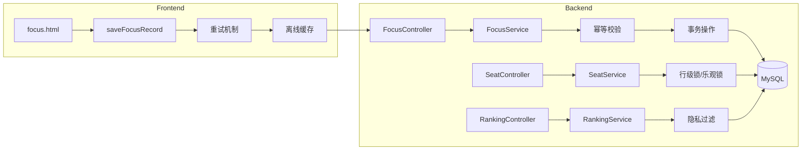
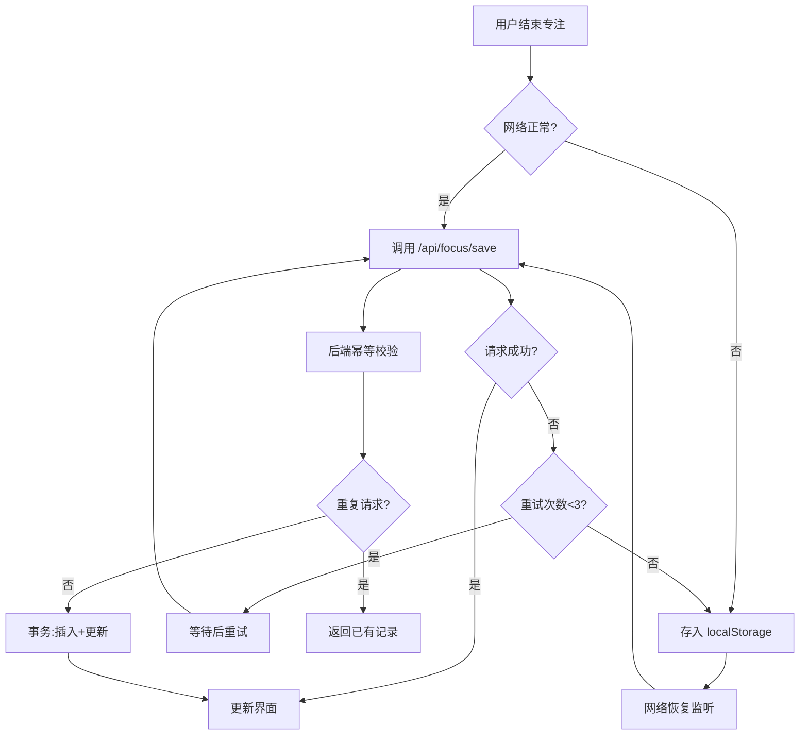

## 产品概述

依次对"云端自习室"项目进行 5 个优先级改进，增强专注模块的数据可靠性、统一后端返回格式、处理座位并发问题、并添加排行榜隐私保护功能。

## 核心功能

### 1. 专注结算逻辑补全

- 前端在保存专注记录失败时自动重试（最多 3 次，指数退避）
- 使用 localStorage 实现离线缓存，网络恢复后自动补传
- 后端接口支持幂等性（通过 clientId + timestamp 去重）

### 2. 统计数据一致性修复

- 将 focus_records 插入与 learning_stats 更新操作放在同一数据库事务中
- 添加事务失败回滚机制，确保两表数据同步
- 增加数据校验逻辑，检测统计偏差

### 3. 返回格式统一迁移

- 所有 API 响应增加 code 字段（0 表示成功，非 0 为错误码）
- 保留原有 success 字段保持向后兼容
- 创建统一响应工具类 ApiResponse

### 4. 座位并发冲突处理

- 在 occupySeat 操作中使用数据库行级锁（SELECT ... FOR UPDATE）
- 或采用乐观锁（version 字段）机制
- 返回友好的冲突提示信息

### 5. 排行榜隐私保护

- 用户表新增 hide_ranking 字段控制排名显示
- 个人设置页面添加"隐藏我的排名"开关
- 排行榜查询时过滤隐藏用户或显示为"匿名用户"

## 技术栈

- 后端框架：Spring Boot 2.x + MyBatis-Plus
- 数据库：MySQL
- 前端：Vue 3 CDN + 原生 HTML/CSS/JS
- 设计系统：variables.css 定义的 iOS 风格设计

## 技术架构

### 系统架构



### 模块划分

| 模块 | 职责 | 关键技术 |
| --- | --- | --- |
| 专注结算 | 前端重试+离线缓存+后端幂等 | localStorage, @Transactional |
| 数据一致性 | 事务保证 focus_records 和 learning_stats 同步 | Spring 事务管理 |
| 返回格式 | 统一 API 响应结构 | ApiResponse 工具类 |
| 座位并发 | 防止多用户抢占同一座位 | SELECT FOR UPDATE / 乐观锁 |
| 排行榜隐私 | 用户可选择隐藏排名 | hide_ranking 字段 |


### 数据流



## 实现细节

### 核心目录结构（仅展示修改/新增文件）

```
src/
├── main/
│   ├── java/com/example/qr_code/
│   │   ├── common/
│   │   │   └── ApiResponse.java              # 新增：统一响应类
│   │   ├── controller/
│   │   │   ├── FocusController.java          # 修改：幂等+新响应格式
│   │   │   ├── SeatController.java           # 修改：并发处理
│   │   │   ├── RankingController.java        # 修改：隐私过滤
│   │   │   └── UserController.java           # 修改：隐私设置接口
│   │   ├── service/
│   │   │   ├── FocusService.java             # 修改：幂等逻辑+事务强化
│   │   │   ├── SeatService.java              # 修改：行级锁
│   │   │   └── RankingService.java           # 修改：过滤隐藏用户
│   │   ├── entity/
│   │   │   └── User.java                     # 修改：新增 hideRanking 字段
│   │   └── mapper/
│   │       └── SeatMapper.java               # 修改：FOR UPDATE 查询
│   └── resources/
│       └── static/
│           ├── focus.html                    # 修改：重试+离线缓存逻辑
│           ├── stats.html                    # 修改：隐私设置开关
│           └── js/
│               └── api-utils.js              # 新增：前端请求工具
```

### 关键代码结构

**ApiResponse 统一响应类**

```java
public class ApiResponse<T> {
    private int code;          // 0=成功, 非0=错误码
    private boolean success;   // 兼容旧版
    private String message;
    private T data;
    
    public static <T> ApiResponse<T> success(T data) { }
    public static <T> ApiResponse<T> error(int code, String message) { }
}
```

**幂等请求体**

```java
public class FocusSaveRequest {
    private String clientId;      // 客户端生成的唯一ID
    private Long timestamp;       // 请求时间戳
    private Integer duration;
    private String type;
}
```

**座位行级锁查询**

```java
// SeatMapper.xml
@Select("SELECT * FROM seats WHERE id = #{id} FOR UPDATE")
Seat selectByIdForUpdate(Long id);
```

### 技术实现方案

#### 1. 专注结算幂等性

- 问题：网络波动导致重复提交
- 方案：clientId + timestamp 组合去重，5分钟内相同请求返回已有记录
- 实现：FocusService 增加 findByClientIdAndTimestamp 查询

#### 2. 数据一致性

- 问题：focus_records 和 learning_stats 可能不同步
- 方案：@Transactional 注解确保原子性，异常时全部回滚
- 实现：saveFocusRecord 方法已有事务，需确认传播行为为 REQUIRED

#### 3. 座位并发

- 问题：两用户同时抢座导致数据异常
- 方案：SELECT FOR UPDATE 悲观锁
- 实现：SeatMapper 新增 selectByIdForUpdate 方法

#### 4. 排行榜隐私

- 问题：用户不希望公开学习时长排名
- 方案：User 表新增 hide_ranking 字段，查询时过滤或匿名化
- 实现：RankingService 查询时 WHERE hide_ranking = 0 或显示"匿名用户"

## 技术考量

### 性能优化

- 幂等校验使用 clientId + timestamp 索引查询
- 座位锁定使用行级锁而非表级锁，减少锁竞争
- 离线缓存数据量控制在 50 条以内

### 安全措施

- 幂等 ID 由前端生成 UUID，后端校验格式
- 座位操作需验证用户登录状态
- 隐私设置只能修改自己的数据

### 数据库变更

```sql
-- 用户表新增隐私字段
ALTER TABLE users ADD COLUMN hide_ranking TINYINT(1) DEFAULT 0 COMMENT '隐藏排名: 0-显示, 1-隐藏';
```

## Agent Extensions

### MCP

- **mysql**
- 用途：执行数据库结构变更，添加 users 表的 hide_ranking 字段
- 预期结果：成功执行 ALTER TABLE 语句，新增隐私控制字段

### SubAgent

- **code-explorer**
- 用途：在实现过程中搜索相关代码模式（如其他 Controller 的返回格式、现有事务配置）
- 预期结果：快速定位需要修改的文件和方法