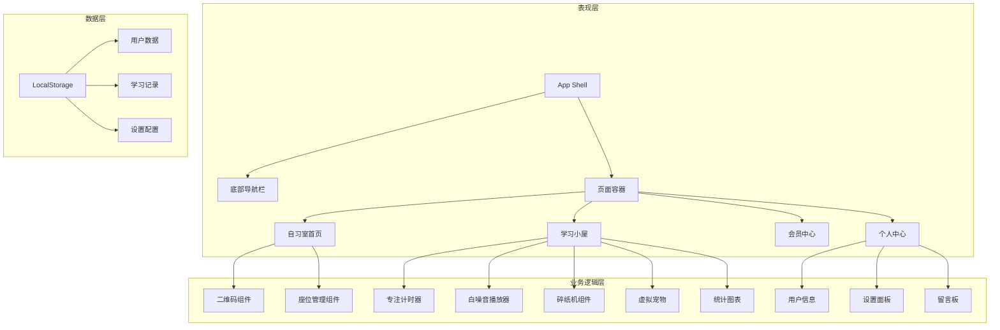
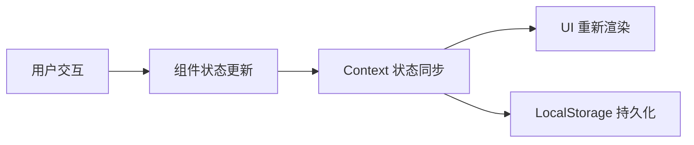

## 产品概述

云端自习室是一款面向学习者的在线自习平台，采用苹果风格设计系统，以移动端优先的底部导航架构为核心，提供沉浸式学习体验。界面采用 iOS 风格中性色调，白底配合浅灰卡片和紫色强调色，通过圆角卡片、大留白和清晰层级打造现代简洁的视觉效果。

## 核心功能

### 自习室首页

- 二维码签到：展示用户专属二维码，支持快速签到入座
- 座位管理：可视化座位布局，显示座位状态（空闲/占用），支持选座入座

### 学习小屋

- 专注计时器：番茄钟/自定义计时模式，记录专注时长
- 白噪音播放：提供多种环境音效（雨声、咖啡厅、森林等）
- 碎纸机：趣味化的任务完成/压力释放功能
- 虚拟宠物：陪伴学习的互动宠物，随学习时长成长
- 学习统计：可视化展示学习数据（日/周/月统计图表）

### 会员中心

- 会员权益展示：展示会员专属功能和权益
- 会员开通入口：预留会员购买/升级功能

### 个人中心

- 用户信息：头像、昵称、学习等级等个人资料展示与编辑
- 设置：主题切换、通知管理、账号安全等系统设置
- 留言板：用户反馈和建议提交功能

## 技术选型

- 前端框架：React + TypeScript
- 样式方案：Tailwind CSS
- 组件库：shadcn/ui
- 构建工具：Vite
- 状态管理：React Context + Hooks

## 技术架构

### 系统架构

采用组件化分层架构，以移动端优先的响应式设计为核心：



### 模块划分

| 模块 | 职责 | 核心组件 |
| --- | --- | --- |
| 导航模块 | 底部Tab导航、页面路由 | BottomNav, TabBar |
| 自习室模块 | 二维码展示、座位选择 | QRCode, SeatMap |
| 学习小屋模块 | 专注工具、白噪音、统计 | Timer, AudioPlayer, Stats |
| 会员模块 | 会员权益展示 | MemberCard, Benefits |
| 个人中心模块 | 用户管理、设置 | Profile, Settings, Feedback |


### 数据流



## 实现细节

### 核心目录结构

```
src/
├── components/
│   ├── layout/
│   │   ├── BottomNav.tsx      # 底部导航栏
│   │   └── PageContainer.tsx  # 页面容器
│   ├── study-room/
│   │   ├── QRCodeCard.tsx     # 二维码卡片
│   │   └── SeatMap.tsx        # 座位地图
│   ├── study-cabin/
│   │   ├── FocusTimer.tsx     # 专注计时器
│   │   ├── WhiteNoise.tsx     # 白噪音播放器
│   │   ├── Shredder.tsx       # 碎纸机
│   │   ├── VirtualPet.tsx     # 虚拟宠物
│   │   └── StudyStats.tsx     # 学习统计
│   ├── member/
│   │   └── MemberBenefits.tsx # 会员权益
│   └── profile/
│       ├── UserInfo.tsx       # 用户信息
│       ├── Settings.tsx       # 设置面板
│       └── MessageBoard.tsx   # 留言板
├── pages/
│   ├── StudyRoom.tsx          # 自习室首页
│   ├── StudyCabin.tsx         # 学习小屋
│   ├── Member.tsx             # 会员中心
│   └── Profile.tsx            # 个人中心
├── hooks/
│   ├── useTimer.ts            # 计时器逻辑
│   └── useAudio.ts            # 音频播放逻辑
├── contexts/
│   └── AppContext.tsx         # 全局状态
└── types/
    └── index.ts               # 类型定义
```

### 关键代码结构

**用户数据接口**：定义用户基本信息结构

```typescript
interface UserData {
  id: string;
  nickname: string;
  avatar: string;
  level: number;
  totalStudyTime: number;
  joinDate: Date;
}
```

**学习记录接口**：记录每次学习会话数据

```typescript
interface StudyRecord {
  id: string;
  startTime: Date;
  endTime: Date;
  duration: number;
  type: 'focus' | 'pomodoro';
}
```

**导航配置**：底部导航栏配置结构

```typescript
interface NavItem {
  id: string;
  label: string;
  icon: React.ReactNode;
  path: string;
}
```

## 设计风格

采用 Apple Human Interface Guidelines 设计规范，打造简洁优雅的 iOS 风格界面。以移动端优先为核心理念，通过底部固定导航实现四大模块的快速切换。

## 页面规划

### 1. 自习室首页

- **顶部区域**：简洁标题栏，显示"云端自习室"和当前日期
- **二维码卡片**：大尺寸圆角卡片，中央展示用户专属二维码，下方显示用户ID和签到状态
- **座位选择区**：网格布局展示座位状态，使用不同颜色区分空闲/占用状态，支持点击选座
- **快捷入口**：横向滑动卡片，提供快速开始学习的入口

### 2. 学习小屋

- **顶部区域**：页面标题"学习小屋"
- **功能卡片网格**：2x2 或 2x3 网格布局，每个功能独立卡片
- 专注计时器：圆形进度环，显示剩余时间
- 白噪音：音效图标网格，支持多选混合
- 碎纸机：趣味动画入口卡片
- 虚拟宠物：宠物形象展示，显示成长等级
- **学习统计**：底部统计卡片，展示今日/本周学习时长柱状图

### 3. 会员中心

- **顶部区域**：页面标题"会员中心"
- **会员卡片**：渐变紫色背景大卡片，展示会员等级和权益
- **权益列表**：图标+文字列表，展示各项会员特权
- **开通按钮**：底部固定紫色渐变按钮，引导开通会员

### 4. 个人中心

- **用户信息卡片**：头像、昵称、等级徽章、累计学习时长
- **功能列表**：分组列表样式
- 账号设置组：编辑资料、账号安全
- 偏好设置组：主题切换、通知管理
- 其他：留言反馈、关于我们
- **退出登录**：底部红色文字按钮

### 5. 底部导航栏

- 固定底部，毛玻璃背景效果
- 四个Tab图标：自习室、学习小屋、会员、我的
- 选中状态使用紫色强调色，带有轻微缩放动画

## 子智能体

- **code-explorer**
- 用途：探索现有项目结构，了解当前代码组织方式和已有组件
- 预期结果：获取项目目录结构、现有组件列表和技术栈信息，为 UI 重构提供基础