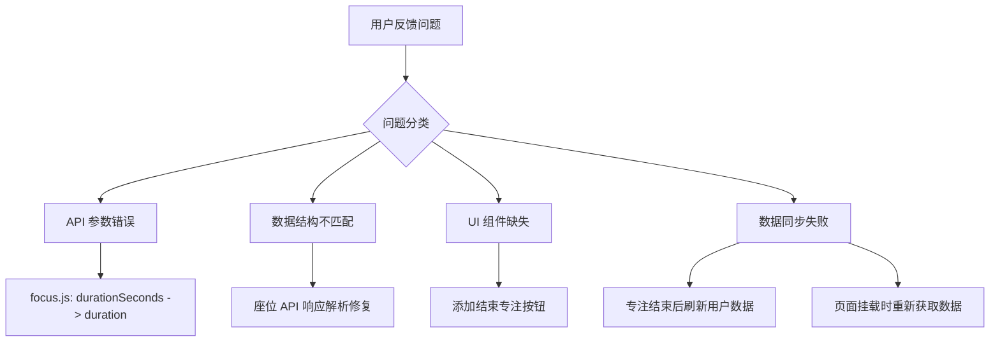

## 产品概述

本计划旨在全面修复 Vue 前端应用中存在的 API 调用错误、功能缺失和数据同步问题，确保其功能与 HTML 版本完全一致，提供稳定可靠的用户体验。

## 核心功能修复

### 1. 管理员权限识别与界面切换

- 修复管理员登录后无法进入管理后台的问题
- 确保根据用户角色正确显示对应界面（管理员/普通用户）

### 2. 自习室座位状态显示

- 修复座位状态区域显示空白的问题
- 正确解析后端返回的座位数据结构并渲染座位状态

### 3. 专注页面功能完善

- 添加缺失的"结束专注休息一下"按钮
- 修复 focus.js API 参数名错误（`durationSeconds` 改为 `duration`）
- 确保专注结束后正确调用 API 保存数据

### 4. 数据同步与刷新机制

- 修复专注结束后经验值和专注次数不更新的问题
- 修复 StudyCabin.vue 学习小屋页面数据不刷新问题
- 修复 Stats.vue 学习统计页面无法正常运行的问题

## 技术栈

- 前端框架：Vue 3
- API 通信：Axios
- 状态管理：Vue Composition API

## 技术架构

### 问题诊断与修复策略



### 模块划分

- **认证模块**：修复用户角色判断逻辑，确保管理员正确跳转
- **座位模块**：修复 API 响应数据解析，正确渲染座位状态
- **专注模块**：修复 API 参数、添加结束按钮、完善数据保存流程
- **统计模块**：修复页面初始化和数据获取逻辑

### 数据流修复

用户操作 → API 调用（修正参数名）→ 后端处理 → 响应数据（正确解析）→ 状态更新 → UI 刷新

## 实现细节

### 核心目录结构（仅显示需修改的文件）

```
src/
├── api/
│   └── focus.js          # 修复: duration 参数名
├── views/
│   ├── Focus.vue         # 修复: 添加结束按钮、数据刷新
│   ├── Home.vue          # 修复: 座位状态渲染、管理员判断
│   ├── StudyCabin.vue    # 修复: 数据更新逻辑
│   └── Stats.vue         # 修复: 页面初始化错误
├── router/
│   └── index.js          # 检查: 管理员路由守卫
└── stores/
    └── user.js           # 检查: 用户角色状态管理
```

### 关键代码修复

**focus.js API 参数修正**

```javascript
// 修复前
export const saveFocusRecord = (durationSeconds) => {
  return request.post('/focus/save', { durationSeconds })
}

// 修复后
export const saveFocusRecord = (duration) => {
  return request.post('/focus/save', { duration })
}
```

**Focus.vue 添加结束按钮逻辑**

```javascript
// 添加结束专注方法
const endFocus = async () => {
  await saveFocusRecord(elapsedSeconds.value)
  await refreshUserStats()  // 刷新用户统计数据
  // 显示结束提示或跳转
}
```

**座位数据解析修复**

```javascript
// 确保正确解析后端返回的座位数据结构
const seats = response.data.data || response.data || []
```

### 技术实现要点

1. **API 参数对齐**：检查所有 API 调用，确保参数名与后端接口一致
2. **响应数据解析**：统一处理后端响应格式，兼容 `response.data.data` 和 `response.data`
3. **数据刷新机制**：在关键操作后主动调用刷新方法更新页面数据
4. **错误处理**：添加适当的错误捕获和用户提示

## Agent Extensions

### SubAgent

- **code-explorer**
- 用途：全面探索项目代码结构，定位所有需要修复的文件和具体代码位置
- 预期结果：获取完整的问题代码定位，包括 API 调用、组件逻辑、路由配置等