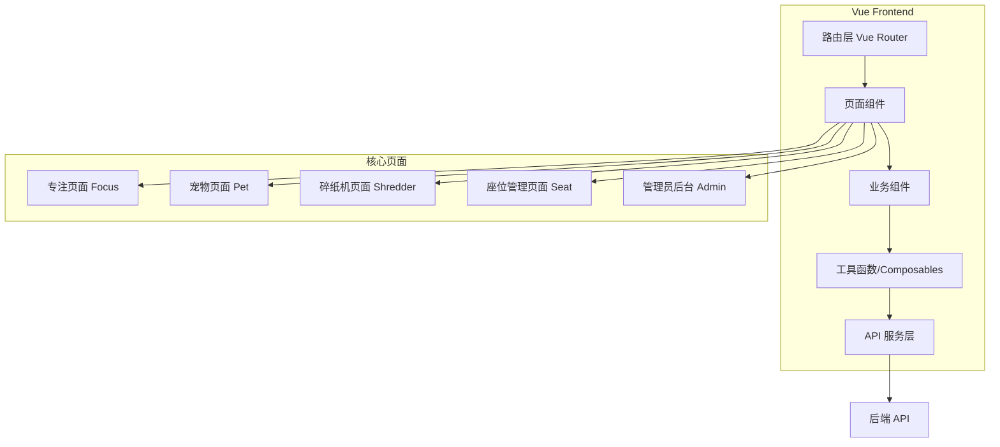
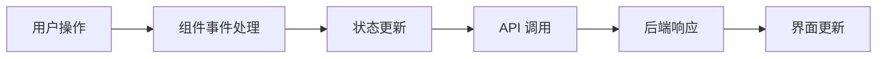

## Product Overview

基于现有 Vue 前端项目，对照 HTML 版本和 md 文档需求，修复已知 Bug 并完善全部功能，确保 Vue 版本与 HTML 版本功能一致，同时补齐任务书中要求的核心模块。

## Core Features

### Bug 修复

- 扫码入座页面返回按钮跳转修复：从 /login 改为 /index
- 碎纸机词条数量补充：从 12 个扩展到更多负面情绪词条

### 专注页面功能完善

- 宠物快捷互动功能：喂食、抚摸、玩耍、聊天四个互动按钮
- 白噪音音量控制滑块
- 页面离开提醒确认弹窗
- 宠物拖动定位功能

### 宠物页面功能完善

- 心情值衰减机制（每5分钟衰减1点）
- 经验值实时更新显示
- 宠物自主行为循环动画
- 升级提示弹窗
- 对话词条扩展：从 26 条补充到 90 条以上

### 碎纸机页面功能完善

- 碎纸过程音效
- 碎纸完成音效

### 座位智能电源控制与订单模块（P0）

- 座位状态实时显示
- 电源开关控制
- 订单创建与管理
- 计时计费功能

### 管理员后台模块（P1）

- 管理员登录认证
- 座位管理面板
- 用户管理功能
- 数据统计展示

## Tech Stack

- 前端框架：Vue 3 + TypeScript
- 构建工具：Vite
- 样式方案：CSS/SCSS
- 状态管理：Vue Composition API
- 路由：Vue Router

## Tech Architecture

### System Architecture



### Module Division

- **专注模块**：专注计时、白噪音控制、宠物互动、离开提醒
- **宠物模块**：宠物状态管理、心情衰减、经验系统、自主行为、对话系统
- **碎纸机模块**：负面情绪词条、碎纸动画、音效播放
- **座位订单模块**：座位状态、电源控制、订单管理、计时计费
- **管理员模块**：登录认证、座位管理、用户管理、数据统计

### Data Flow



## Implementation Details

### Core Directory Structure

基于现有 Vue 项目结构，需要修改和新增的文件：

```
vue-frontend/
├── src/
│   ├── views/
│   │   ├── Focus.vue          # 修改：添加宠物互动、音量控制、离开提醒
│   │   ├── Pet.vue            # 修改：心情衰减、经验更新、自主行为、对话扩展
│   │   ├── Shredder.vue       # 修改：词条扩展、音效添加
│   │   ├── ScanSeat.vue       # 修改：返回按钮跳转修复
│   │   ├── Seat.vue           # 新增：座位管理页面
│   │   └── admin/
│   │       ├── AdminLogin.vue # 新增：管理员登录
│   │       ├── Dashboard.vue  # 新增：管理后台首页
│   │       ├── SeatManage.vue # 新增：座位管理
│   │       └── UserManage.vue # 新增：用户管理
│   ├── components/
│   │   ├── PetInteraction.vue # 新增：宠物互动组件
│   │   ├── VolumeSlider.vue   # 新增：音量控制组件
│   │   └── LeaveConfirm.vue   # 新增：离开确认弹窗
│   ├── composables/
│   │   ├── usePetBehavior.ts  # 新增：宠物行为逻辑
│   │   ├── useMoodDecay.ts    # 新增：心情衰减逻辑
│   │   └── useSeatOrder.ts    # 新增：座位订单逻辑
│   ├── data/
│   │   ├── petDialogs.ts      # 修改：扩展对话词条
│   │   └── shredderPhrases.ts # 修改：扩展碎纸机词条
│   └── assets/
│       └── audio/
│           ├── shred.mp3      # 新增：碎纸音效
│           └── complete.mp3   # 新增：完成音效
```

### Key Code Structures

**宠物心情衰减逻辑**：实现每5分钟心情值自动衰减1点的机制，确保宠物需要持续互动维护。

```typescript
// composables/useMoodDecay.ts
interface MoodDecayOptions {
  interval: number;      // 衰减间隔（毫秒）
  decayAmount: number;   // 每次衰减量
  minMood: number;       // 最低心情值
}

function useMoodDecay(petState: Ref<PetState>, options: MoodDecayOptions) {
  // 启动衰减定时器
  // 更新心情值
  // 触发状态变化回调
}
```

**座位订单管理**：处理座位预约、入座、离座、计费等核心业务逻辑。

```typescript
// composables/useSeatOrder.ts
interface SeatOrder {
  orderId: string;
  seatId: string;
  userId: string;
  startTime: Date;
  endTime?: Date;
  status: 'pending' | 'active' | 'completed';
  totalFee: number;
}

function useSeatOrder() {
  // 创建订单
  // 开始计时
  // 结束订单
  // 计算费用
}
```

### Technical Implementation Plan

**宠物互动功能实现**

1. 问题：专注页面缺少宠物快捷互动入口
2. 方案：参考 HTML 版本，在专注页面添加悬浮互动面板
3. 技术：Vue 组件 + CSS 动画 + 事件处理
4. 步骤：创建互动组件 -> 集成到专注页面 -> 绑定互动逻辑 -> 添加动画反馈
5. 验证：测试四种互动功能是否正常触发并更新宠物状态

**心情衰减机制实现**

1. 问题：宠物心情值不会自动衰减
2. 方案：使用 setInterval 定时器实现周期性衰减
3. 技术：Vue Composable + 定时器 + 响应式状态
4. 步骤：创建衰减逻辑 -> 页面挂载时启动 -> 卸载时清理 -> 同步到后端
5. 验证：观察心情值是否按预期衰减

## Agent Extensions

### SubAgent

- **code-explorer**
- Purpose：探索 HTML 版本源码和 Vue 版本代码，对比功能差异，定位需要修改的具体文件和代码位置
- Expected outcome：获取 HTML 版本的宠物互动、对话词条、碎纸机词条等完整实现细节，以及 Vue 版本当前的代码结构