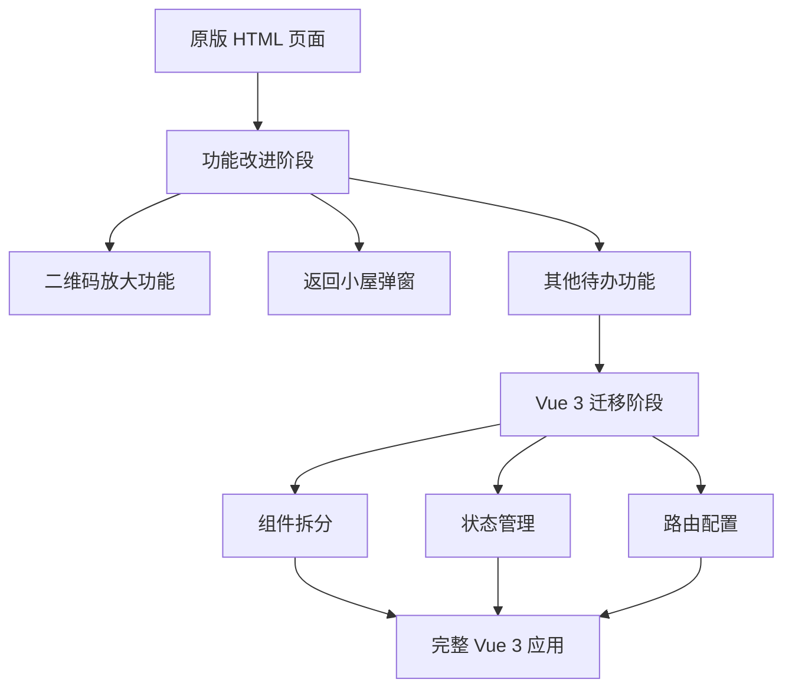

## 产品概述

将现有 React 半成品前端废弃，使用 Vue 3 + Vite + JavaScript 完整重构前端应用。在重构前，先在原版 HTML 页面上实现待办功能改进，确保功能完整后再全面迁移到 Vue 3。同时新增一键部署文档。

## 核心功能

- 二维码放大功能：点击二维码图片可放大查看
- 返回小屋弹窗：提供返回主页的确认弹窗交互
- 原版 HTML 所有现有功能完整保留
- Vue 3 组件化重构，对齐原版 HTML 全部功能
- 一键部署文档，方便快速部署项目

## 技术栈

- 前端框架：Vue 3 + Vite
- 开发语言：JavaScript（不使用 TypeScript）
- 样式方案：保持原版 HTML 样式风格

## 技术架构

### 系统架构

采用 Vue 3 组件化架构，将原版 HTML 页面拆分为可复用的 Vue 组件。



### 模块划分

- **HTML 功能增强模块**：在原版 HTML 基础上实现二维码放大、返回弹窗等功能
- **Vue 组件模块**：将 HTML 页面拆分为 Header、QRCode、Modal 等组件
- **文档模块**：md 目录下的部署文档和开发文档

### 数据流

用户交互 → 事件处理 → 状态更新 → 视图渲染

## 实现细节

### 核心目录结构

```
qr_code/
├── md/                          # 文档目录
│   └── deploy.md                # 新增：一键部署文档
├── src/
│   └── main/
│       └── resources/
│           └── static/
│               ├── index.html   # 原版 HTML（先在此实现功能改进）
│               ├── css/
│               └── js/
├── vue-frontend/                # 新增：Vue 3 前端项目
│   ├── index.html
│   ├── vite.config.js
│   ├── package.json
│   └── src/
│       ├── main.js
│       ├── App.vue
│       ├── components/
│       │   ├── QRCodeViewer.vue
│       │   ├── ModalDialog.vue
│       │   └── Header.vue
│       └── assets/
```

### 关键代码结构

**二维码放大功能**：点击二维码图片触发放大弹窗显示

```javascript
// 二维码放大处理
function showQRCodeModal(imgSrc) {
  const modal = document.getElementById('qrModal');
  const modalImg = document.getElementById('qrModalImg');
  modalImg.src = imgSrc;
  modal.style.display = 'flex';
}
```

**返回小屋弹窗**：确认返回主页的交互弹窗

```javascript
// 返回确认弹窗
function showBackConfirm() {
  const confirmed = confirm('确定要返回小屋吗？');
  if (confirmed) {
    window.location.href = '/';
  }
}
```

### 技术实现方案

1. **HTML 功能增强**：直接在原版 index.html 中添加 JavaScript 实现二维码放大和弹窗功能
2. **Vue 3 迁移**：使用 Vite 创建新项目，将 HTML 结构转换为 Vue 组件
3. **样式迁移**：保持原版 CSS 样式，确保视觉一致性

## Agent Extensions

### SubAgent

- **code-explorer**
- 用途：探索现有项目结构，了解原版 HTML 页面的完整功能和代码组织
- 预期结果：获取原版 HTML 的完整功能清单和代码结构，为功能改进和 Vue 迁移提供依据