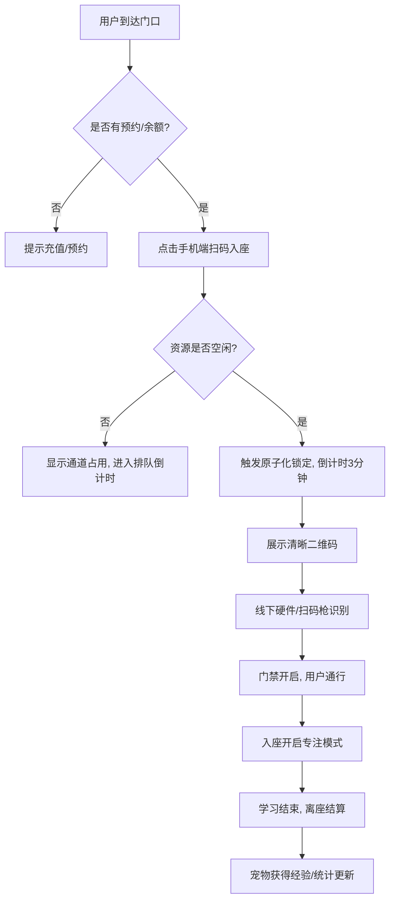
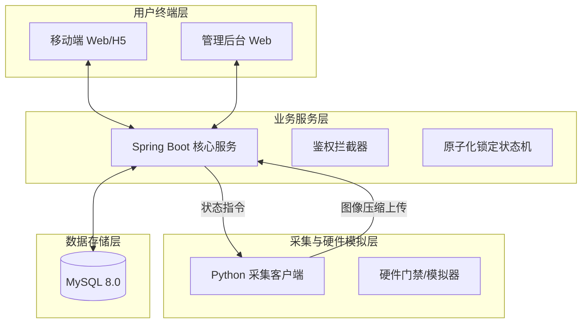
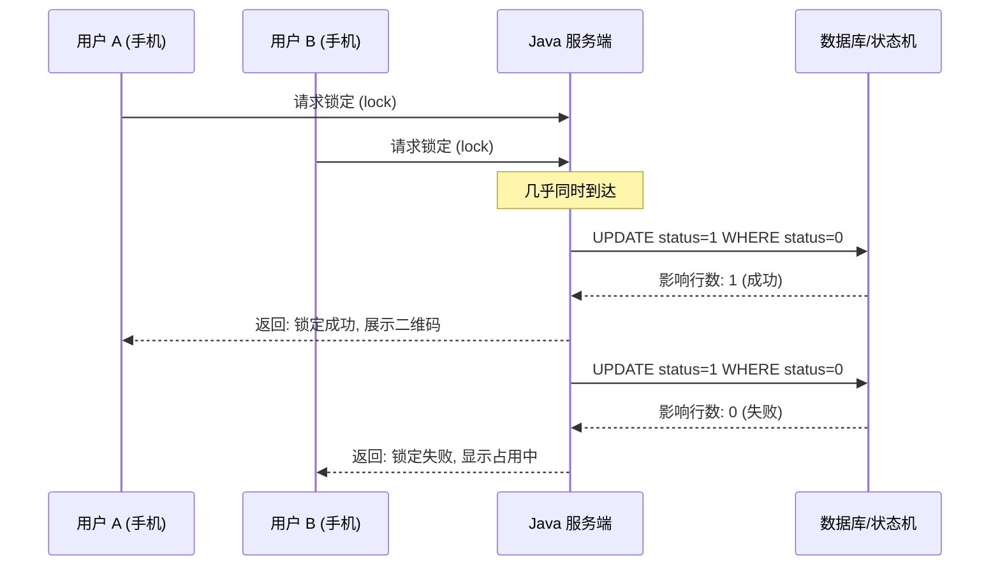

# 毕业设计方案拟定图表描述 (Mermaid/逻辑图)

本文件提供了课题开题报告中所需的关键逻辑图表描述。你可以将这些 Mermaid 代码复制到支持 Mermaid 的编辑器中（如 Notion, Obsidian, GitHub 等）直接生成图片，或者作为绘图参考。

---

## 1. 核心业务流程图 (Business Workflow)
描述用户从进入自习室到离开的完整生命周期。



---

## 2. 系统总体架构图 (System Architecture)
描述软硬协同的四层架构设计。



---

## 3. 数据库 ER 关系图 (Database ERD)
展示核心实体的关联关系。

```mermaid
erDiagram
    USER ||--o{ FOCUS_RECORD : "产生"
    USER ||--o1 USER_PET : "拥有"
    USER ||--o{ MESSAGE_BOARD : "发布"
    USER ||--o{ SEAT_RESERVATION : "预约"
    SEAT ||--o{ SEAT_RESERVATION : "被预约"
    MESSAGE_BOARD ||--o{ MESSAGE_REPLY : "包含"
    
    USER {
        bigint id PK
        string username
        int study_days
    }
    FOCUS_RECORD {
        bigint id PK
        bigint user_id FK
        int duration
        string type
    }
    SEAT {
        bigint id PK
        string seat_code
        int status
    }
```

---

## 4. 核心算法：原子化通行窗口时序图 (Sequence Diagram)
展示“抢占式锁定”在并发环境下的逻辑表现。



---

## 5. 论文引用说明 (建议)
在论文中引用上述图表时，可搭配以下文字：
- **图1 (业务流程)**：展示了系统如何通过软件预锁定的方式，将物理空间的排队行为前置到逻辑层，降低了硬件冲突的概率。
- **图4 (算法时序)**：体现了“抢占式”设计的原子性。通过数据库行锁或原子更新，确保了在 180 秒的通行窗口内，资源分配的唯一性和安全性。
